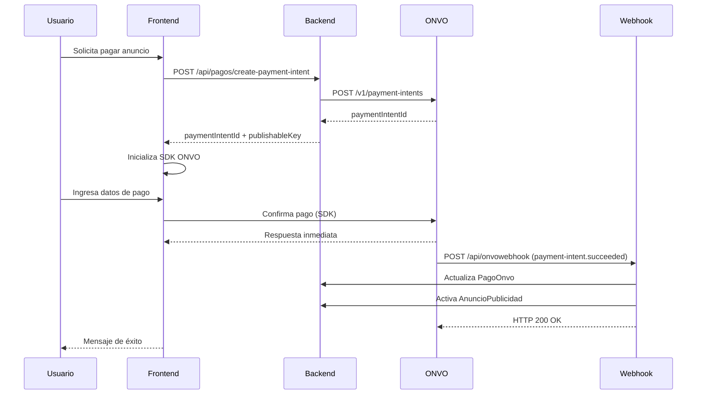

# Integración ONVO Pay - Documentación

## 📋 Resumen de la Implementación

Se ha integrado exitosamente la pasarela de pago ONVO Pay en AutoClick con las siguientes capacidades:

- ✅ Backend (.NET) para crear sesiones de pago (Payment Intents)
- ✅ Frontend con SDK de ONVO para checkout embebido
- ✅ Webhook seguro para confirmar pagos
- ✅ Activación automática de anuncios al aprobar pago
- ✅ Manejo de estados: approved (succeeded), rejected (failed), pending (processing), deferred

## 🏗️ Arquitectura

### Backend Components

1. **Modelos de Datos** (`Models/`)
   - `PagoOnvo.cs`: Registro de pagos con ONVO
   - `WebhookEventOnvo.cs`: Log de eventos webhook

2. **Servicio Principal** (`Services/`)
   - `OnvoPayService.cs`: Lógica de integración con API de ONVO
   - `OnvoPaySettings.cs`: Configuración
   - `OnvoPayDtos.cs`: DTOs para requests/responses

3. **Controladores** (`Controllers/Api/`)
   - `PagosController.cs`: API endpoints para crear payment intents
   - `OnvoWebhookController.cs`: Endpoint para recibir webhooks

### Frontend Components

4. **Páginas de Pago** (`Pages/Pagos/`)
   - `ProcessPayment.cshtml`: Vista de checkout con SDK integrado
   - `ProcessPayment.cshtml.cs`: PageModel

## 📊 Base de Datos

### Tablas Creadas

**PagosOnvo**
```sql
- Id (int, PK)
- PaymentIntentId (string, 100) - ID de ONVO
- AnuncioPublicidadId (int, nullable, FK)
- Amount (int) - en centavos/céntimos
- Currency (string, 3) - USD o CRC
- Status (string, 50) - Estado del pago
- Description (string, 500)
- UsuarioId (int, nullable) - Sin FK por incompatibilidad de PK
- EmailUsuario (string, 255)
- Metadata (nvarchar(max)) - JSON
- LastPaymentError (nvarchar(max)) - JSON
- CreatedAt (DateTime)
- UpdatedAt (DateTime)
- CompletedAt (DateTime, nullable)
- ConfirmationAttempts (int)
```

**WebhookEventsOnvo**
```sql
- Id (int, PK)
- EventType (string, 100)
- PaymentIntentId (string, 100)
- Payload (nvarchar(max)) - JSON completo
- Processed (bool)
- ProcessingError (nvarchar(max))
- ReceivedAt (DateTime)
- ProcessedAt (DateTime, nullable)
- WebhookSecret (string, 500)
```

### Migración

```bash
dotnet ef migrations add AddOnvoPayTables --context ApplicationDbContext
```

Para aplicar en producción:
```bash
dotnet ef database update --context ApplicationDbContext
```

## 🔧 Configuración

### appsettings.json

```json
{
  "OnvoPay": {
    "BaseUrl": "https://api.onvopay.com",
    "SecretKey": "onvo_test_secret_key_...",
    "PublishableKey": "onvo_test_publishable_key_...",
    "WebhookSecret": "",
    "Currency": "USD",
    "TimeoutSeconds": 30
  }
}
```

**IMPORTANTE**: 
- Para producción, cambiar las keys de `test` a `live`
- Configurar `WebhookSecret` después de registrar el webhook en ONVO Dashboard
- Nunca commitear las keys reales al repositorio

### Variables de Entorno (Recomendado para Producción)

```bash
ONVO_SECRET_KEY=onvo_live_secret_key_...
ONVO_PUBLISHABLE_KEY=onvo_live_publishable_key_...
ONVO_WEBHOOK_SECRET=tu_webhook_secret
```

## 🔌 API Endpoints

### 1. Crear Payment Intent

**POST** `/api/pagos/create-payment-intent`

Request:
```json
{
  "amount": 5000,
  "currency": "USD",
  "description": "Publicidad Premium - 30 días",
  "anuncioPublicidadId": 123
}
```

Response:
```json
{
  "paymentIntentId": "cl4de13uc457301lor2o0q9w1",
  "amount": 5000,
  "currency": "USD",
  "status": "requires_confirmation",
  "publishableKey": "onvo_test_publishable_key_..."
}
```

### 2. Consultar Estado de Pago

**GET** `/api/pagos/status/{paymentIntentId}`

Response:
```json
{
  "paymentIntentId": "cl4de13uc457301lor2o0q9w1",
  "status": "succeeded",
  "amount": 5000,
  "currency": "USD",
  "description": "Publicidad Premium - 30 días",
  "createdAt": "2025-12-30T10:00:00Z",
  "completedAt": "2025-12-30T10:05:23Z"
}
```

### 3. Obtener Configuración

**GET** `/api/pagos/config`

Response:
```json
{
  "publishableKey": "onvo_test_publishable_key_..."
}
```

### 4. Webhook Endpoint

**POST** `/api/onvowebhook`

Headers:
```
X-Webhook-Secret: tu_webhook_secret
Content-Type: application/json
```

Body (ejemplo):
```json
{
  "type": "payment-intent.succeeded",
  "data": {
    "id": "cl4de13uc457301lor2o0q9w1",
    "amount": 5000,
    "currency": "USD",
    "status": "succeeded",
    ...
  }
}
```

## 🎨 Uso del Frontend

### Integración Básica

```html
<!-- En tu layout o página -->
<script src="https://sdk.onvopay.com/sdk.js"></script>

<div id="onvo-payment-container"></div>

<script>
  const onvoInstance = onvo.pay({
    publicKey: 'onvo_test_publishable_key_...',
    paymentIntentId: 'cl4de13uc457301lor2o0q9w1',
    paymentType: 'one_time',
    locale: 'es',
    onSuccess: (data) => {
      if (data.status === 'succeeded') {
        // Pago exitoso
        window.location.href = '/success';
      }
    },
    onError: (error) => {
      console.error('Error:', error);
    }
  });

  onvoInstance.render('#onvo-payment-container');
</script>
```

### Página de Pago Completa

Redirigir a:
```
/Pagos/ProcessPayment?anuncioId=123&amount=5000&currency=USD&description=Publicidad Premium
```

## 🔐 Seguridad del Webhook

### Configuración en ONVO Dashboard

1. Ir a **Desarrolladores** → **Webhooks**
2. Agregar nuevo webhook con URL: `https://tudominio.com/api/onvowebhook`
3. Copiar el **Secret** generado
4. Actualizar `appsettings.json` con el secret

### Validación en el Código

El webhook valida automáticamente:
- El secret recibido en header `X-Webhook-Secret`
- El payload JSON
- Previene procesamiento duplicado

## 📝 Flujo Completo de Pago



## 🧪 Testing con Tarjetas de Prueba

### Tarjeta Aprobada (VISA)
```
Número: 4242424242424242
Expiración: 12/26
CVV: 123
Nombre: JUAN PEREZ
```

### Tarjeta con 3DS Challenge (VISA)
```
Número: 4000000000003220
Expiración: 12/26
CVV: 123
```

### Tarjeta Declinada
```
Número: 4000000000000002
Expiración: 12/26
CVV: 123
```

### SINPE Móvil de Prueba

**Exitoso (15 seg):**
```
+50688888888
```

**Exitoso con retraso (6 min):**
```
+50688884444
```

**Fallido:**
```
+50688889521
```

## 📈 Estados de Pago

| Estado | Descripción | Acción |
|--------|-------------|--------|
| `requires_confirmation` | Creado, esperando confirmación | Usuario debe completar pago |
| `requires_payment_method` | Pago rechazado | Mostrar error, permitir reintentar |
| `requires_action` | Requiere 3DS u otra acción | SDK maneja automáticamente |
| `processing` | En procesamiento (SINPE) | Mostrar mensaje de espera |
| `succeeded` | Pago exitoso | Activar anuncio, redirigir |
| `failed` | Pago fallido | Mostrar error detallado |
| `canceled` | Cancelado manualmente | No procesar |

## 🔍 Monitoreo y Debugging

### Ver Webhooks Recibidos

**GET** `/api/onvowebhook/history?limit=10`

### Logs Importantes

```csharp
// En OnvoPayService.cs
_logger.LogInformation("Payment Intent creado exitosamente. ID: {PaymentIntentId}", paymentIntent.id);
_logger.LogInformation("Anuncio {AnuncioId} activado por pago exitoso {PaymentIntentId}", anuncio.Id, paymentIntent.id);
_logger.LogError("Error al crear Payment Intent. Status: {Status}, Response: {Response}", response.StatusCode, responseContent);
```

### Health Check del Webhook

**GET** `/api/onvowebhook/health`

Response:
```json
{
  "status": "healthy",
  "timestamp": "2025-12-30T10:00:00Z",
  "service": "ONVO Webhook Handler"
}
```

## 🚀 Despliegue a Producción

### Checklist Pre-Producción

- [ ] Cambiar keys de test a live en configuración
- [ ] Configurar webhook URL en ONVO Dashboard
- [ ] Actualizar `WebhookSecret` en configuración
- [ ] Ejecutar migración de base de datos
- [ ] Probar webhook con herramientas como ngrok o webhook.site
- [ ] Configurar variables de entorno en Azure/servidor
- [ ] Revisar logs de aplicación
- [ ] Probar flujo completo con tarjeta real (monto mínimo)

### Aplicar Migración en Producción

```bash
# Opción 1: Desde local (requiere conexión a DB de producción)
dotnet ef database update --context ApplicationDbContext

# Opción 2: Desde Azure (recomendado)
# La migración se aplica automáticamente al desplegar si está configurado
```

### URL del Webhook en Producción

```
https://autoclick.azurewebsites.net/api/onvowebhook
```

## 💡 Mejoras Futuras (Opcionales)

1. **Dashboard de Pagos**
   - Crear página administrativa para ver todos los pagos
   - Filtros por estado, fecha, usuario

2. **Notificaciones por Email**
   - Enviar confirmación de pago al usuario
   - Notificar administrador de pagos exitosos

3. **Reembolsos**
   - Implementar endpoint para procesar reembolsos
   - UI en panel de administración

4. **Reportes**
   - Generar reportes de ingresos
   - Exportar a CSV/Excel

5. **Retry Logic**
   - Reintentar webhooks fallidos automáticamente
   - Queue de procesamiento

## 🆘 Troubleshooting

### Problema: Payment Intent no se crea

**Solución:**
- Verificar que las keys en `appsettings.json` sean correctas
- Revisar logs de aplicación
- Verificar conexión a internet del servidor

### Problema: Webhook no se recibe

**Solución:**
- Verificar que la URL esté correctamente configurada en ONVO Dashboard
- Asegurarse que el endpoint sea accesible públicamente
- Revisar tabla `WebhookEventsOnvo` para ver si llegan pero fallan
- Usar herramientas como ngrok para testing local

### Problema: Pago no activa el anuncio

**Solución:**
- Verificar en `WebhookEventsOnvo` que el webhook fue procesado
- Revisar logs del servicio
- Verificar que `AnuncioPublicidadId` esté correctamente asociado

### Problema: SDK no se carga en frontend

**Solución:**
- Verificar que el script `https://sdk.onvopay.com/sdk.js` esté incluido
- Revisar consola del navegador para errores
- Asegurarse que `publicKey` y `paymentIntentId` sean válidos

## 📚 Referencias

- [Documentación oficial de ONVO](https://docs.onvopay.com)
- [Referencia API de ONVO](https://api.onvopay.com/docs)
- [SDK de JavaScript](https://sdk.onvopay.com)
- [Dashboard de ONVO](https://dashboard.onvopay.com)

## 📧 Soporte

Para problemas con la integración:
1. Revisar logs de la aplicación
2. Consultar esta documentación
3. Revisar documentación oficial de ONVO
4. Contactar soporte de ONVO si es problema de su servicio

---

**Versión:** 1.0  
**Fecha:** 30 de diciembre de 2025  
**Autor:** GitHub Copilot
